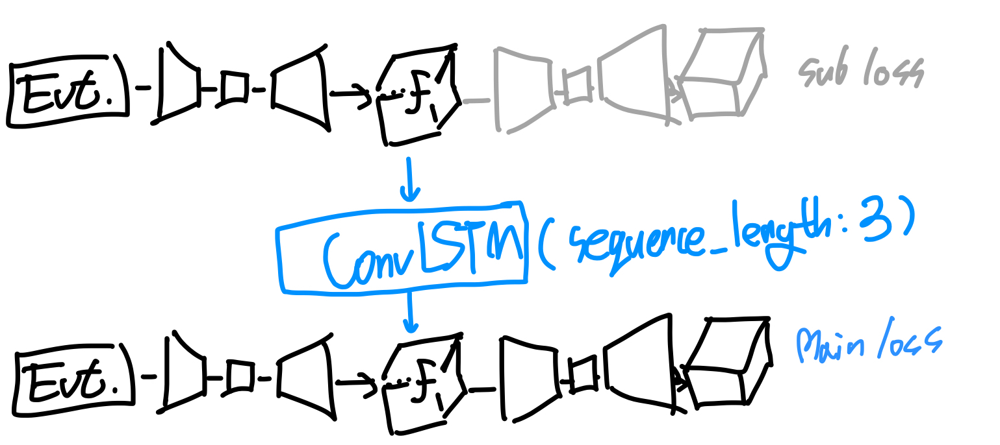
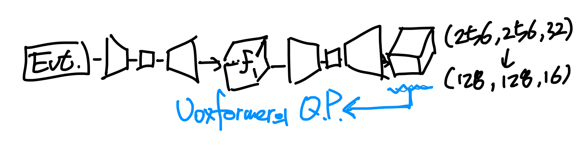

# Event MonoScene: 
# Usage

# Modification
## TODOs
- [ ] 노드 별 환경변수 설정 및 환경변수에 따른, W&B 실험 이름 변경하기.
- [ ] Event 반영한 모델 코드 작성하기.
- [x] 저차원 MonoScene 반영하기 (VoxFormer의 query로 사용하기 위함).

## RNN MonoScene (25.02.19)
{: width="30"}

## 저차원 MonoScene (25.02.17)
{: width="30"}
- [목적] (128,128,16) 차원의 복셀을 출력하기 위한 코드임 (이전에는 (256,256,32) 차원).
- [결과] 저차원/고차원을 셸 스크립트의 변수를 바꿔 가면서 실험할 수 있음.
- `preprocess.forLowResolution.py` 파일을 통해, (128,128,16) 복셀을 생성하여, `~/preprocess_cw_lowResolution` 폴더에 전처리하여 저장함.
- `monoscene.config` 파일에 `low_resolution` 인자를 추가함 (스크립트 파일에서도 사용할 수 있음).
- `train_monoscene.py` 파일에서 `scene_size`, `low_resolution(경로)`를 저차원에 맞도록 수정함.
- `kitti_dataset.py` 파일에서 `voxel_size`를 0.2 에서 0.4로 변경하고, `vox2pix` 함수에서 제대로 반영하도록 수정함.

# Source
 

